<h1 align="center">
  My Social Network
</h1>


[//]: # (![Testing]&#40;https://img.shields.io/badge/testing-Jest-954058.svg&#41;)

> This is my educational **Fullstack Web App** where I practice my skills and explore new technologies!

## Folder Structure

```
📦social_network
 ┣ 📁database
 ┣ 📁pgadmin
 ┃
 ┣ 📁client
 ┃ ┣ 📁node_modules
 ┃ ┣ 📁app
 ┃ ┃ ┣📁[locale]
 ┃ ┃ ┃ ┣📁components
 ┃ ┃ ┃ ┣📁signin
 ┃ ┃ ┃ ┣📁[userId]
 ┃ ┃ ┃ ┃  ┗📁...
 ┃ ┃ ┃ ┃
 ┃ ┃ ┃ ┗📁page.tsx
 ┃ ┃ ┃ 
 ┃ ┃ ┣📁_configs
 ┃ ┃ ┣📁_services
 ┃ ┃ ┣📁_utils
 ┃ ┃ ┣📁api
 ┃ ┃ ┣📁_ui
 ┃ ┃ ┃ ┣📁base (базовые компоненты + реэкспорт из библиотек)
 ┃ ┃ ┃ ┣📁common (комопненты для этого проекта)
 ┃ ┃ ┃ ┗📁styles
 ┃ ┃ ┃   ┣📁templates (css-шаблоны)
 ┃ ┃ ┃   ┣📁variables (css-переменые)
 ┃ ┃ ┃   ┣📄_index.scss
 ┃ ┃ ┃   ┣📄app.scss (отдельные css-переменые для всего проекта)
 ┃ ┃ ┃   ┣📄base.scss (стили по умолчанию)
 ┃ ┃ ┃   ┣📄colors.scss
 ┃ ┃ ┃   ┣📄fonts.scss
 ┃ ┃ ┃   ┣📄funcions.scss
 ┃ ┃ ┃   ┣📄for_components.scss (для импорта в компоненты)
 ┃ ┃ ┃   ┗📄mixins.scss
 ┃ ┃ ┃ 
 ┃ ┃ ┣ 📄defauilt-tags.tsx
 ┃ ┃ ┣ 📄global-error.tsx
 ┃ ┃ ┣ 📄head.tsx
 ┃ ┃ ┣ 📄layout.tsx
 ┃ ┃ ┣ 📄not-found.tsx
 ┃ ┃ ┣ 📄loading.tsx
 ┃ ┃ ┗ 📄page.tsx
 ┃ ┃  
 ┃ ┃  
 ┃ ┣ 📁middlwares
 ┃ ┃ ┣📄auth.ts
 ┃ ┃ ┣📄location.ts
 ┃ ┃ ┗📄utils.ts
 ┃ ┃
 ┃ ┣ 📁shared
 ┃ ┃ ┣📁hooks
 ┃ ┃ ┣📁types
 ┃ ┃ ┗📁utils
 ┃ ┃
 ┃ ┣ 📁translations
 ┃ ┃ ┣📄en.json
 ┃ ┃ ┣📄ru.json
 ┃ ┃ ┗📁...
 ┃ ┃
 ┃ ┣ 📁public
 ┃ ┃ ┣📁favicon
 ┃ ┃ ┣📁fonts
 ┃ ┃ ┣📁icons
 ┃ ┃ ┣📁images
 ┃ ┃ ┗📁videos
 ┃ ┃ 
 ┃ ┣ 📄.dockerignore
 ┃ ┣ 📄public
 ┃ ┣ 📄package.json
 ┃ ┗ 📄next.config.js
 ┃ ┗ ...
 ┃
 ┣ 📁server
 ┃ ┣ 📁node_modules
 ┃ ┣ 📄.dockerignore
 ┃ ┣ 📄package.json
 ┃ ┗ ...
 ┃
 ┣ 📄.env
 ┣ 📄Makefile
 ┗📄docker-compose.dev.yml
 ┗📄docker-compose.prod.yml

 ```

## Runs

DEV:

```
docker-compose -f docker-compose.dev.yml up --build
```

PROD:

```
docker-compose -f docker-compose.prod.yml up --build
```

STOP:

```
docker-compose -f docker-compose.yml down
```

Currently, I'm working on the client side. 
I'll work on the server side later. 
What's already done on the server side was done a while ago.


#### Used Technologies:

| General    | 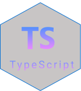 | 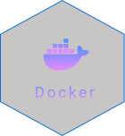 |  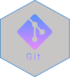 |                                                       |
|------------|-----------------------------------------------------------|--------------|------|-------------------------------------------------------|
| **Client** | 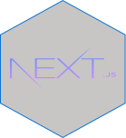        | 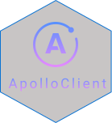 | 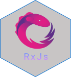 | 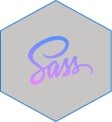                                                      |
| **Server** | 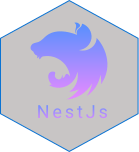          | 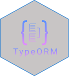 | 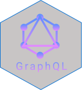 | 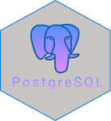 |
