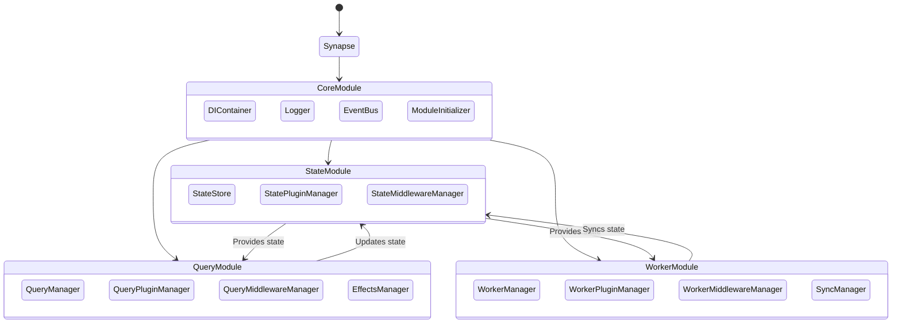

# Synapse-система

### Задача

Создать систему, которая:
- Предоставляет удобное и универсальное API для управления состоянием.
  - Централизованное хранение.
  - реактивность.
- Поддерживает создание запросов:
  - Управление кэшем.
  - Доступ к состоянию.
  - Отдельное место в состоянии для хранения результатов запросов (например "api").
  - Инвалидирование кэша.
  - Конфигурируемые параметры и middleware для запросов.
  - Политики повторных попыток (retry policy).
  - Механизм отмены запросов и очистки ресурсов.
  - многоуровневая система конфигурации:
    - на уровне основного сервиса:
      - передача корневого url.
      - флаг необходимости кэширования.
      - время кэша.
      - сущности на различные жизненные циклы запроса:
        - сущность которая будет отображаться если loading.
        - сущность которая будет отображаться если error.
      - прочие настройки
    - на уровне группы (нечто похожее на createApi из RTK Query)
    - на уровне самого эндроинта
- Имеет модульную систему расширений:
  - Каждый модуль предоставляет свой API для плагинов/middlewares
  - Плагины/middlewares устанавливаются через конфигурацию модуля
  - Модули сами управляют своими плагинами/middlewares
  - Единый интерфейс создания плагинов/middlewares в рамках каждого модуля
- Поддерживает гибкие варианты хранения данных:
  - В оперативной памяти (по умолчанию).
  - В localStorage/sessionStorage.
  - В indexDB.
  - Расширяемую систему синхронизации данных.
  - Единый интерфейс доступа к данным через адаптеры.
- Содержит Worker Module:
  - Для работы с ServiceWorkers, SharedWorkers и Broadcast Channel.
  - Поддерживает:
    - Кэширование.
    - Синхронизацию состояния между вкладками.
    - Расширение через плагины.
    - Стратегии fallback при недоступности Worker API.
- Позволяет легко добавлять новые функции:
  - Синхронизация состояния с сервером.
  - Расширение функционала по мере роста приложения.
  - Масштабирование системы с мониторингом метрик.
- Основана на сегментированном EventBus:
  - Приоритизация и фильтрация событий.
  - Управление жизненным циклом модулей и сервисов.
  - Обеспечение реактивности через Observable.
  - Механизм масштабирования при высокой нагрузке.
- Гибкость и модульность:
  - Базовые функции реализованы внутри ядра.
  - Все остальное — через плагины.
- Предоставляет функции для:
  - Добавления глобальных и модульных middlewares.
  - Создания глобальных и модульных плагинов.

## Структура системы

### Модули

1. Core Module

Центральный модуль, отвечающий за:
- Сегментированную коммуникацию между модулями через EventBus.
- Логирование, отладку.
- Инициализацию системы и порядок загрузки модулей.

Компоненты Core Module:
- LoggerService (Гибкая система логирования)
- SegmentedEventBus (система событий с поддержкой приоритетов и сегментации)
- DIContainer (DI контейнер)
- ModuleInitializer (Управление порядком загрузки и инициализации модулей)

2. StateManagement Module

Модуль для работы с состоянием, обеспечивающий:
- Централизованное хранилище данных.
- Реактивность и подписки на изменения (через Observable).
- Гибкие стратегии кэширования и синхронизации.
- Поддержку разных хранилищ.

Компоненты StateManagement Module:
- StateStore: Основное хранилище состояния с поддержкой реактивности.
- StorageAdapter: Адаптеры для работы с разными типами хранилищ.
- CacheStrategy: Стратегии управления кэшем.

3. Query Module

Модуль для работы с запросами, предоставляющий:
- Удобное построение запросов с кэшированием.
- Middleware для управления поведением запросов.
- Интеграцию с StateStore для хранения и обновления данных.
- Политики повторных попыток и отмены запросов.
- Возможность создания сложной цепочки запросов и подписки на состояния других запросов, например:
  - при подписке на success получения пользователя вызывать другой запрос
  - при подписке на failure получения пользователя вызввать несколько событий (уведомление + еще какой нибудь запрос)
  - иные сценарии суть которых в подписке на одни события, проведения необходимых вычислений (есл нужно) и вызове других событий

Компоненты Query Module:
- QueryManager: Управление запросами.
- QueryBuilder: Конструктор запросов с цепочкой методов.
- QueryExecutor: Выполнение запросов с retry policy и отменой.
- RetryPolicyManager: Управление политиками повторных попыток.

4. Worker Module

Модуль многопоточности, обеспечивающий:
- Работа с WebWorkers, ServiceWorkers и SharedWorkers.
- Обмен сообщениями между потоками через EventBus.
- Синхронизацию состояния между вкладками.
- Стратегии fallback при недоступности Worker API.

Компоненты Worker Module:
- WorkerManager: Управление жизненным циклом воркеров.
- WorkerStrategyManager: Управление стратегиями выполнения задач.
- MessageBroker: Обмен сообщениями между потоками.
- SyncManager: Управление синхронизацией состояния.

Основные связи между модулями:
1. Core → Modules:
  - ModuleInitializer контролирует порядок загрузки.
  - SegmentedEventBus обеспечивает коммуникацию.
  - Передает пользовательские плагины и middlewares в остальные модули и сервисы.
2. StateManagement → Query/Worker:
  - Событийное взаимодействие через сегменты EventBus.

