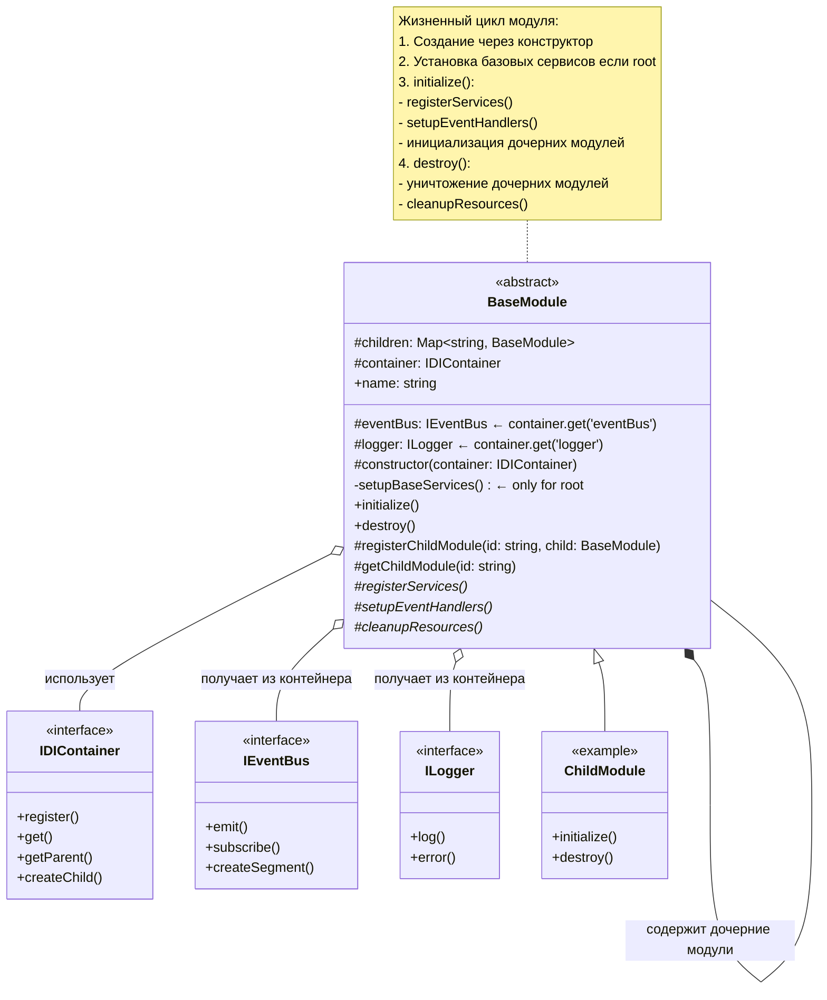
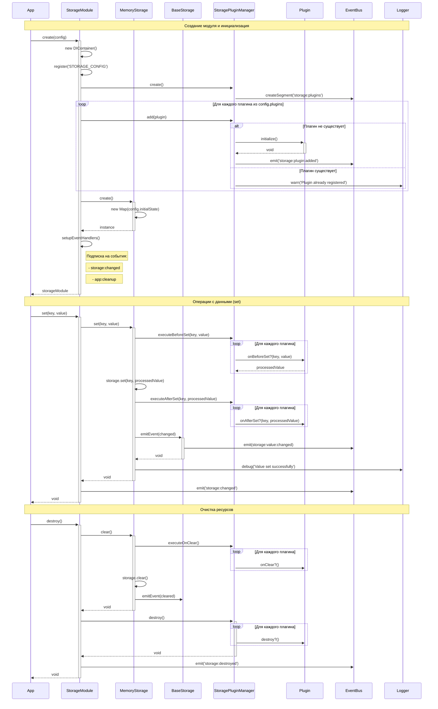

```mermaid
classDiagram
    note for BaseModule "Жизненный цикл модуля:
    1. Создание через конструктор
    2. Установка базовых сервисов если root
    3. initialize():
       - registerServices()
       - setupEventHandlers()
       - инициализация дочерних модулей
    4. destroy():
       - уничтожение дочерних модулей
       - cleanupResources()"

    class BaseModule {
        <<abstract>>
        #children: Map~string, BaseModule~
        #container: IDIContainer
        #eventBus: IEventBus ← container.get('eventBus')
        #logger: ILogger ← container.get('logger')
        +name: string
        
        #constructor(container: IDIContainer)
        -setupBaseServices() ← only for root
        +initialize()
        +destroy()
        #registerChildModule(id: string, child: BaseModule)
        #getChildModule(id: string)
        #registerServices()*
        #setupEventHandlers()*
        #cleanupResources()*
    }

    class IDIContainer {
        <<interface>>
        +register()
        +get()
        +getParent()
        +createChild()
    }

    class IEventBus {
        <<interface>>
        +emit()
        +subscribe()
        +createSegment()
    }

    class ILogger {
        <<interface>>
        +log()
        +error()
    }

    class ChildModule {
        <<example>>
        +initialize()
        +destroy()
    }

    BaseModule <|-- ChildModule
    BaseModule o-- IDIContainer : использует
    BaseModule o-- IEventBus : получает из контейнера
    BaseModule o-- ILogger : получает из контейнера
    BaseModule *-- BaseModule : содержит дочерние модули
```

```mermaid
sequenceDiagram
    participant App
    participant SM as StorageModule
    participant MS as MemoryStorage
    participant BS as BaseStorage
    participant PM as StoragePluginManager
    participant P as Plugin
    participant EB as EventBus
    participant L as Logger

    Note over App,L: Создание модуля и инициализация
    App->>+SM: create(config)
    SM->>SM: new DIContainer()
    SM->>SM: register('STORAGE_CONFIG')

    SM->>+PM: create()
    PM->>EB: createSegment('storage:plugins')

    loop Для каждого плагина из config.plugins
        SM->>PM: add(plugin)
        alt Плагин не существует
            PM->>+P: initialize()
            P-->>-PM: void
            PM->>EB: emit('storage:plugin:added')
        else Плагин существует
            PM->>L: warn('Plugin already registered')
        end
    end

    SM->>+MS: create()
    MS->>MS: new Map(config.initialState)
    MS-->>-SM: instance

    SM->>SM: setupEventHandlers()
    note right of SM: Подписка на события:
    note right of SM: - storage:changed
    note right of SM: - app:cleanup
    SM-->>-App: storageModule

    Note over App,L: Операции с данными (set)
    App->>+SM: set(key, value)
    SM->>+MS: set(key, value)

    MS->>PM: executeBeforeSet(key, value)
    loop Для каждого плагина
        PM->>P: onBeforeSet?(key, value)
        P-->>PM: processedValue
    end

    MS->>MS: storage.set(key, processedValue)

    MS->>PM: executeAfterSet(key, processedValue)
    loop Для каждого плагина
        PM->>P: onAfterSet?(key, processedValue)
    end

    MS->>+BS: emitEvent(changed)
    BS->>EB: emit(storage:value:changed)
    BS-->>-MS: void

    MS->>L: debug('Value set successfully')
    MS-->>-SM: void
    SM->>EB: emit('storage:changed')
    SM-->>-App: void

    Note over App,L: Очистка ресурсов
    App->>+SM: destroy()
    SM->>+MS: clear()
    MS->>PM: executeOnClear()

    loop Для каждого плагина
        PM->>P: onClear?()
    end

    MS->>MS: storage.clear()
    MS->>BS: emitEvent(cleared)
    MS-->>-SM: void

    SM->>+PM: destroy()
    loop Для каждого плагина
        PM->>P: destroy?()
    end
    PM-->>-SM: void

    SM->>EB: emit('storage:destroyed')
    SM-->>-App: void
```
