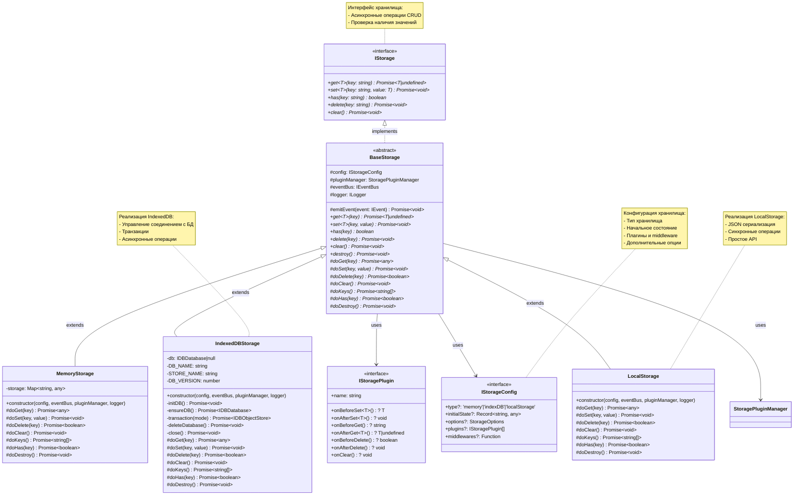

```mermaid
classDiagram
    class IStorage {
        <<interface>>
        +get~T~(key: string)* Promise~T|undefined~
        +set~T~(key: string, value: T)* Promise~void~
        +has(key: string)* boolean
        +delete(key: string)* Promise~void~
        +clear()* Promise~void~
    }
    note for IStorage "Интерфейс хранилища:
    - Асинхронные операции CRUD
    - Проверка наличия значений"

    class IStorageConfig {
        <<interface>>
        +type?: 'memory'|'indexDB'|'localStorage'
        +initialState?: Record~string, any~
        +options?: StorageOptions
        +plugins?: IStoragePlugin[]
        +middlewares?: Function
    }
    note for IStorageConfig "Конфигурация хранилища:
    - Тип хранилища
    - Начальное состояние
    - Плагины и middleware
    - Дополнительные опции"

    class BaseStorage {
        <<abstract>>
        #config: IStorageConfig
        #pluginManager: StoragePluginManager
        #eventBus: IEventBus
        #logger: ILogger
        #emitEvent(event: IEvent) Promise~void~
        +get~T~(key)* Promise~T|undefined~
        +set~T~(key, value)* Promise~void~
        +has(key)* boolean
        +delete(key)* Promise~void~
        +clear()* Promise~void~
        +destroy()* Promise~void~
        #doGet(key)* Promise~any~
        #doSet(key, value)* Promise~void~
        #doDelete(key)* Promise~boolean~
        #doClear()* Promise~void~
        #doKeys()* Promise~string[]~
        #doHas(key)* Promise~boolean~
        #doDestroy()* Promise~void~
    }

    class MemoryStorage {
        -storage: Map~string, any~
        +constructor(config, eventBus, pluginManager, logger)
        #doGet(key) Promise~any~
        #doSet(key, value) Promise~void~
        #doDelete(key) Promise~boolean~
        #doClear() Promise~void~
        #doKeys() Promise~string[]~
        #doHas(key) Promise~boolean~
        #doDestroy() Promise~void~
    }

    class IndexedDBStorage {
        -db: IDBDatabase|null
        -DB_NAME: string
        -STORE_NAME: string
        -DB_VERSION: number
        +constructor(config, eventBus, pluginManager, logger)
        -initDB() Promise~void~
        -ensureDB() Promise~IDBDatabase~
        -transaction(mode) Promise~IDBObjectStore~
        -deleteDatabase() Promise~void~
        -close() Promise~void~
        #doGet(key) Promise~any~
        #doSet(key, value) Promise~void~
        #doDelete(key) Promise~boolean~
        #doClear() Promise~void~
        #doKeys() Promise~string[]~
        #doHas(key) Promise~boolean~
        #doDestroy() Promise~void~
    }
    note for IndexedDBStorage "Реализация IndexedDB:
    - Управление соединением с БД
    - Транзакции
    - Асинхронные операции"

    class LocalStorage {
        +constructor(config, eventBus, pluginManager, logger)
        #doGet(key) Promise~any~
        #doSet(key, value) Promise~void~
        #doDelete(key) Promise~boolean~
        #doClear() Promise~void~
        #doKeys() Promise~string[]~
        #doHas(key) Promise~boolean~
        #doDestroy() Promise~void~
    }
    note for LocalStorage "Реализация LocalStorage:
    - JSON сериализация
    - Синхронные операции
    - Простое API"

    class IStoragePlugin {
        <<interface>>
        +name: string
        +onBeforeSet~T~()? T
        +onAfterSet~T~()? void
        +onBeforeGet()? string
        +onAfterGet~T~()? T|undefined
        +onBeforeDelete()? boolean
        +onAfterDelete()? void
        +onClear()? void
    }

    IStorage <|.. BaseStorage : implements
    BaseStorage <|-- MemoryStorage : extends
    BaseStorage <|-- IndexedDBStorage : extends
    BaseStorage <|-- LocalStorage : extends
    BaseStorage --> IStorageConfig : uses
    BaseStorage --> IStoragePlugin : uses
    BaseStorage --> StoragePluginManager : uses
```
