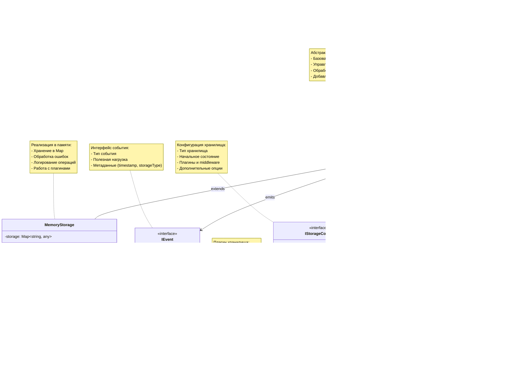
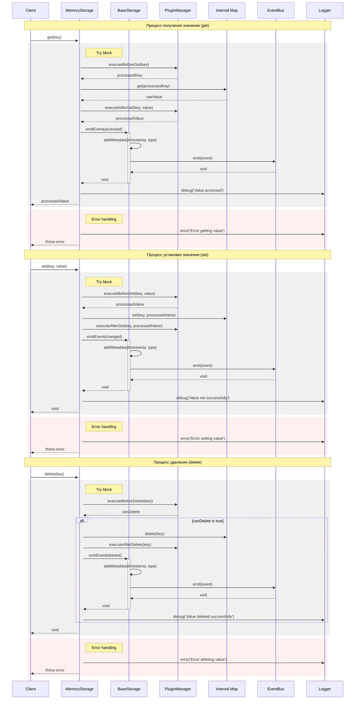

```mermaid
classDiagram
    class IStorage {
        <<interface>>
        +get~T~(key: string)* Promise~T|undefined~
        +set~T~(key: string, value: T)* Promise~void~
        +has(key: string)* boolean
        +delete(key: string)* Promise~void~
        +clear()* Promise~void~
    }
    note for IStorage "Интерфейс хранилища:
    - Асинхронные операции CRUD
    - Проверка наличия значений"

    class IStorageConfig {
        <<interface>>
        +type?: 'memory'|'indexDB'|'localStorage'
        +initialState?: Record~string, any~
        +options?: StorageOptions
        +plugins?: IStoragePlugin[]
        +middlewares?: Function
    }
    note for IStorageConfig "Конфигурация хранилища:
    - Тип хранилища
    - Начальное состояние
    - Плагины и middleware
    - Дополнительные опции"

    class IEvent {
        <<interface>>
        +type: string
        +payload?: any
        +metadata?: EventMetadata
    }
    note for IEvent "Интерфейс события:
    - Тип события
    - Полезная нагрузка
    - Метаданные (timestamp, storageType)"

    class BaseStorage {
        <<abstract>>
        #config: IStorageConfig
        #pluginManager: StoragePluginManager
        #eventBus: IEventBus
        #logger: ILogger
        #emitEvent(event: IEvent) Promise~void~
        +get~T~(key)* Promise~T|undefined~
        +set~T~(key, value)* Promise~void~
        +has(key)* boolean
        +delete(key)* Promise~void~
        +clear()* Promise~void~
    }
    note for BaseStorage "Абстрактный класс хранилища:
    - Базовая функциональность
    - Управление событиями
    - Обработка ошибок
    - Добавление метаданных"

    class MemoryStorage {
        -storage: Map~string, any~
        +constructor(config, eventBus, pluginManager, logger)
        +get~T~(key) Promise~T|undefined~ override
        +set~T~(key, value) Promise~void~ override
        +has(key) boolean override
        +delete(key) Promise~void~ override
        +clear() Promise~void~ override
    }
    note for MemoryStorage "Реализация в памяти:
    - Хранение в Map
    - Обработка ошибок
    - Логирование операций
    - Работа с плагинами"

    class StorageEvent {
        <<enumeration>>
        storage:value:accessed
        storage:value:changed
        storage:value:deleted
        storage:cleared
    }

    class IStoragePlugin {
        <<interface>>
        +name: string
        +onBeforeSet~T~()? T
        +onAfterSet~T~()? void
        +onBeforeGet()? string
        +onAfterGet~T~()? T|undefined
        +onBeforeDelete()? boolean
        +onAfterDelete()? void
        +onClear()? void
    }
    note for IStoragePlugin "Плагин хранилища:
    - Модификация значений
    - Валидация операций
    - Обработка событий"

    IStorage <|.. BaseStorage : implements
    BaseStorage <|-- MemoryStorage : extends
    BaseStorage --> IStorageConfig : uses
    BaseStorage --> IEvent : emits
    MemoryStorage ..> StorageEvent : generates
    BaseStorage --> StoragePluginManager : uses
    BaseStorage --> IEventBus : uses
    BaseStorage --> ILogger : uses
    IStorageConfig --> IStoragePlugin : contains
    StoragePluginManager --> IStoragePlugin : manages
```

```mermaid
sequenceDiagram
    participant C as Client
    participant MS as MemoryStorage
    participant BS as BaseStorage
    participant PM as PluginManager
    participant Map as Internal Map
    participant EB as EventBus
    participant L as Logger

    Note over C,L: Процесс получения значения (get)
    C->>+MS: get(key)

    rect rgb(240, 240, 240)
        Note right of MS: Try block
        MS->>PM: executeBeforeGet(key)
        PM-->>MS: processedKey
        MS->>Map: get(processedKey)
        Map-->>MS: rawValue
        MS->>PM: executeAfterGet(key, value)
        PM-->>MS: processedValue

        MS->>+BS: emitEvent(accessed)
        BS->>BS: addMetadata(timestamp, type)
        BS->>EB: emit(event)
        EB-->>BS: void
        BS-->>-MS: void

        MS->>L: debug('Value accessed')
        MS-->>C: processedValue
    end

    rect rgb(255, 240, 240)
        Note right of MS: Error handling
        MS->>L: error('Error getting value')
        MS-->>C: throw error
    end

    Note over C,L: Процесс установки значения (set)
    C->>+MS: set(key, value)

    rect rgb(240, 240, 240)
        Note right of MS: Try block
        MS->>PM: executeBeforeSet(key, value)
        PM-->>MS: processedValue
        MS->>Map: set(key, processedValue)
        MS->>PM: executeAfterSet(key, processedValue)

        MS->>+BS: emitEvent(changed)
        BS->>BS: addMetadata(timestamp, type)
        BS->>EB: emit(event)
        EB-->>BS: void
        BS-->>-MS: void

        MS->>L: debug('Value set successfully')
        MS-->>C: void
    end

    rect rgb(255, 240, 240)
        Note right of MS: Error handling
        MS->>L: error('Error setting value')
        MS-->>C: throw error
    end

    Note over C,L: Процесс удаления (delete)
    C->>+MS: delete(key)

    rect rgb(240, 240, 240)
        Note right of MS: Try block
        MS->>PM: executeBeforeDelete(key)
        PM-->>MS: canDelete
        alt canDelete is true
            MS->>Map: delete(key)
            MS->>PM: executeAfterDelete(key)

            MS->>+BS: emitEvent(deleted)
            BS->>BS: addMetadata(timestamp, type)
            BS->>EB: emit(event)
            EB-->>BS: void
            BS-->>-MS: void

            MS->>L: debug('Value deleted successfully')
        end
        MS-->>C: void
    end

    rect rgb(255, 240, 240)
        Note right of MS: Error handling
        MS->>L: error('Error deleting value')
        MS-->>C: throw error
    end
```
