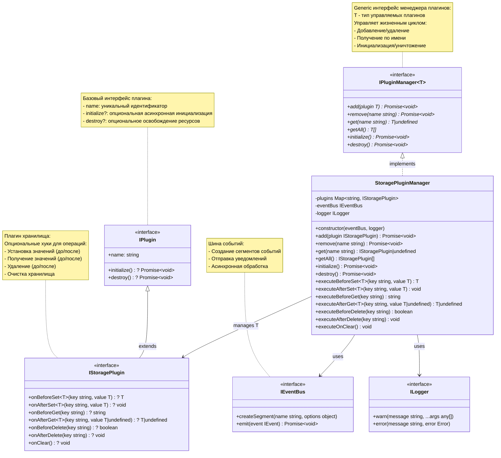
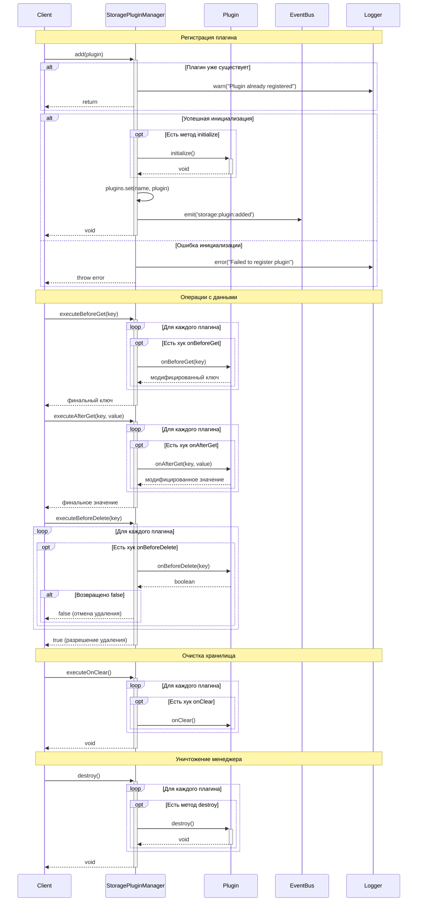

```mermaid
classDiagram
    class IPlugin {
        <<interface>>
        +name: string
        +initialize()? Promise~void~
        +destroy()? Promise~void~
    }
    note for IPlugin "Базовый интерфейс плагина:
    - name: уникальный идентификатор
    - initialize?: опциональная асинхронная инициализация
    - destroy?: опциональное освобождение ресурсов"

    class IPluginManager~T~ {
        <<interface>>
        +add(plugin T)* Promise~void~
        +remove(name string)* Promise~void~
        +get(name string)* T|undefined
        +getAll()* T[]
        +initialize()* Promise~void~
        +destroy()* Promise~void~
    }
    note for IPluginManager "Generic интерфейс менеджера плагинов:
    T - тип управляемых плагинов
    Управляет жизненным циклом:
    - Добавление/удаление
    - Получение по имени
    - Инициализация/уничтожение"

    class IEventBus {
        <<interface>>
        +createSegment(name string, options object)
        +emit(event IEvent) Promise~void~
    }
    note for IEventBus "Шина событий:
    - Создание сегментов событий
    - Отправка уведомлений
    - Асинхронная обработка"

    class ILogger {
        <<interface>>
        +warn(message string, ...args any[])
        +error(message string, error Error)
    }

    class IStoragePlugin {
        <<interface>>
        +onBeforeSet~T~(key string, value T)? T
        +onAfterSet~T~(key string, value T)? void
        +onBeforeGet(key string)? string
        +onAfterGet~T~(key string, value T|undefined)? T|undefined
        +onBeforeDelete(key string)? boolean
        +onAfterDelete(key string)? void
        +onClear()? void
    }
    note for IStoragePlugin "Плагин хранилища:
    Опциональные хуки для операций:
    - Установка значений (до/после)
    - Получение значений (до/после)
    - Удаление (до/после)
    - Очистка хранилища"

    class StoragePluginManager {
        -plugins Map~string, IStoragePlugin~
        -eventBus IEventBus
        -logger ILogger
        +constructor(eventBus, logger)
        +add(plugin IStoragePlugin) Promise~void~
        +remove(name string) Promise~void~
        +get(name string) IStoragePlugin|undefined
        +getAll() IStoragePlugin[]
        +initialize() Promise~void~
        +destroy() Promise~void~
        +executeBeforeSet~T~(key string, value T) T
        +executeAfterSet~T~(key string, value T) void
        +executeBeforeGet(key string) string
        +executeAfterGet~T~(key string, value T|undefined) T|undefined
        +executeBeforeDelete(key string) boolean
        +executeAfterDelete(key string) void
        +executeOnClear() void
    }

    IPlugin <|-- IStoragePlugin : extends
    IPluginManager <|.. StoragePluginManager : implements
    StoragePluginManager --> IStoragePlugin : manages T
    StoragePluginManager --> IEventBus : uses
    StoragePluginManager --> ILogger : uses
```

```mermaid
sequenceDiagram
    participant C as Client
    participant PM as StoragePluginManager
    participant P as Plugin
    participant EB as EventBus
    participant L as Logger

    Note over C,L: Регистрация плагина
    C->>+PM: add(plugin)
    alt Плагин уже существует
        PM->>L: warn("Plugin already registered")
        PM-->>C: return
    end

    alt Успешная инициализация
        opt Есть метод initialize
            PM->>+P: initialize()
            P-->>-PM: void
        end
        PM->>PM: plugins.set(name, plugin)
        PM->>EB: emit('storage:plugin:added')
        PM-->>-C: void
    else Ошибка инициализации
        PM->>L: error("Failed to register plugin")
        PM-->>C: throw error
    end

    Note over C,L: Операции с данными
    C->>+PM: executeBeforeGet(key)
    loop Для каждого плагина
        opt Есть хук onBeforeGet
            PM->>P: onBeforeGet(key)
            P-->>PM: модифицированный ключ
        end
    end
    PM-->>-C: финальный ключ

    C->>+PM: executeAfterGet(key, value)
    loop Для каждого плагина
        opt Есть хук onAfterGet
            PM->>P: onAfterGet(key, value)
            P-->>PM: модифицированное значение
        end
    end
    PM-->>-C: финальное значение

    C->>+PM: executeBeforeDelete(key)
    loop Для каждого плагина
        opt Есть хук onBeforeDelete
            PM->>P: onBeforeDelete(key)
            P-->>PM: boolean
            alt Возвращено false
                PM-->>C: false (отмена удаления)
            end
        end
    end
    PM-->>-C: true (разрешение удаления)

    Note over C,L: Очистка хранилища
    C->>+PM: executeOnClear()
    loop Для каждого плагина
        opt Есть хук onClear
            PM->>P: onClear()
        end
    end
    PM-->>-C: void

    Note over C,L: Уничтожение менеджера
    C->>+PM: destroy()
    loop Для каждого плагина
        opt Есть метод destroy
            PM->>+P: destroy()
            P-->>-PM: void
        end
    end
    PM-->>-C: void
```
