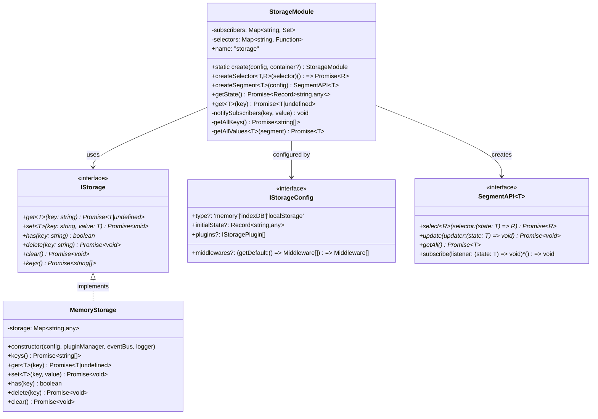
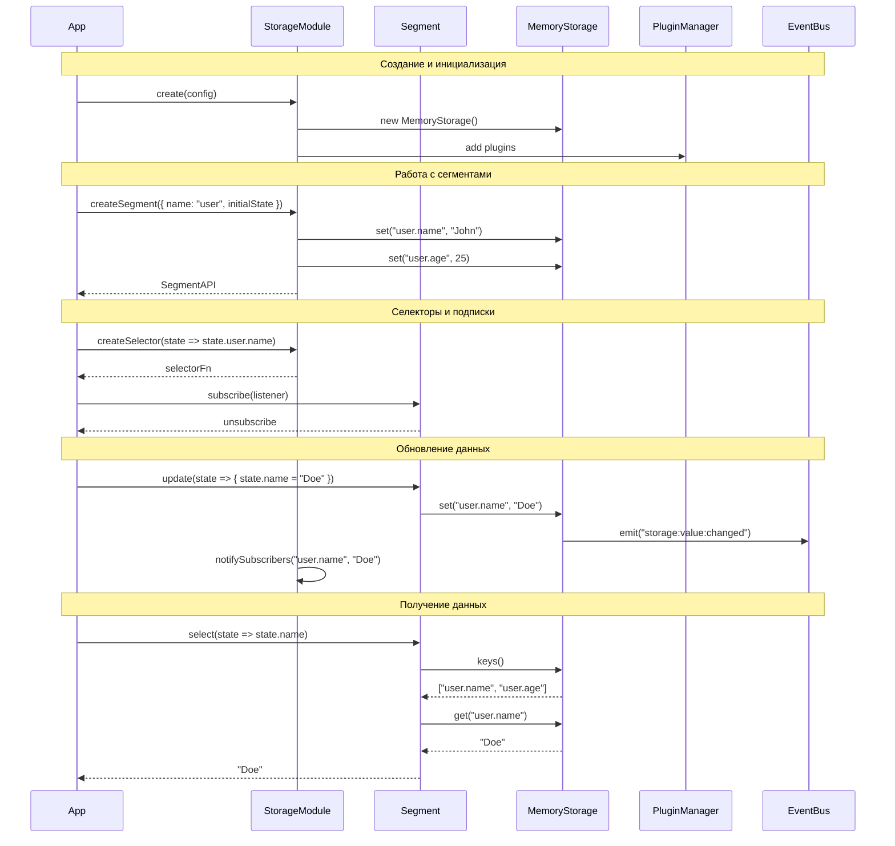

```mermaid
classDiagram
%% Базовые интерфейсы
    class IStorage {
        <<interface>>
        +get~T~(key: string)* Promise~T|undefined~
        +set~T~(key: string, value: T)* Promise~void~
        +has(key: string)* boolean
        +delete(key: string)* Promise~void~
        +clear()* Promise~void~
        +keys()* Promise~string[]~
    }

    class IStorageConfig {
        <<interface>>
        +type?: 'memory'|'indexDB'|'localStorage'
        +initialState?: Record~string,any~
        +plugins?: IStoragePlugin[]
        +middlewares?: (getDefault: () => Middleware[]) => Middleware[]
    }

    class SegmentAPI~T~ {
        <<interface>>
        +select~R~(selector: (state: T) => R)* Promise~R~
        +update(updater: (state: T) => void)* Promise~void~
        +getAll()* Promise~T~
        +subscribe(listener: (state: T) => void)* () => void
    }

%% Основной модуль
    class StorageModule {
        -subscribers: Map~string, Set~
        -selectors: Map~string, Function~
        +name: "storage"
        +static create(config, container?) StorageModule
        +createSelector~T,R~(selector) () => Promise~R~
        +createSegment~T~(config) SegmentAPI~T~
        +getState() Promise~Record~string,any~~
        +get~T~(key) Promise~T|undefined~
        -notifySubscribers(key, value) void
        -getAllKeys() Promise~string[]~
        -getAllValues~T~(segment) Promise~T~
    }

%% Реализация хранилища
    class MemoryStorage {
        -storage: Map~string,any~
        +constructor(config, pluginManager, eventBus, logger)
        +keys() Promise~string[]~
        +get~T~(key) Promise~T|undefined~
        +set~T~(key, value) Promise~void~
        +has(key) boolean
        +delete(key) Promise~void~
        +clear() Promise~void~
    }

%% Связи
    IStorage <|.. MemoryStorage : implements
    StorageModule --> IStorage : uses
    StorageModule --> SegmentAPI : creates
    StorageModule --> IStorageConfig : configured by
```

```mermaid
sequenceDiagram
    participant App
    participant SM as StorageModule
    participant Seg as Segment
    participant MS as MemoryStorage
    participant PM as PluginManager
    participant EB as EventBus

    Note over App,EB: Создание и инициализация
    App->>SM: create(config)
    SM->>MS: new MemoryStorage()
    SM->>PM: add plugins

    Note over App,EB: Работа с сегментами
    App->>SM: createSegment({ name: "user", initialState })
    SM->>MS: set("user.name", "John")
    SM->>MS: set("user.age", 25)
    SM-->>App: SegmentAPI

    Note over App,EB: Селекторы и подписки
    App->>SM: createSelector(state => state.user.name)
    SM-->>App: selectorFn

    App->>Seg: subscribe(listener)
    Seg-->>App: unsubscribe

    Note over App,EB: Обновление данных
    App->>Seg: update(state => { state.name = "Doe" })
    Seg->>MS: set("user.name", "Doe")
    MS->>EB: emit("storage:value:changed")
    SM->>SM: notifySubscribers("user.name", "Doe")

    Note over App,EB: Получение данных
    App->>Seg: select(state => state.name)
    Seg->>MS: keys()
    MS-->>Seg: ["user.name", "user.age"]
    Seg->>MS: get("user.name")
    MS-->>Seg: "Doe"
    Seg-->>App: "Doe"
```
