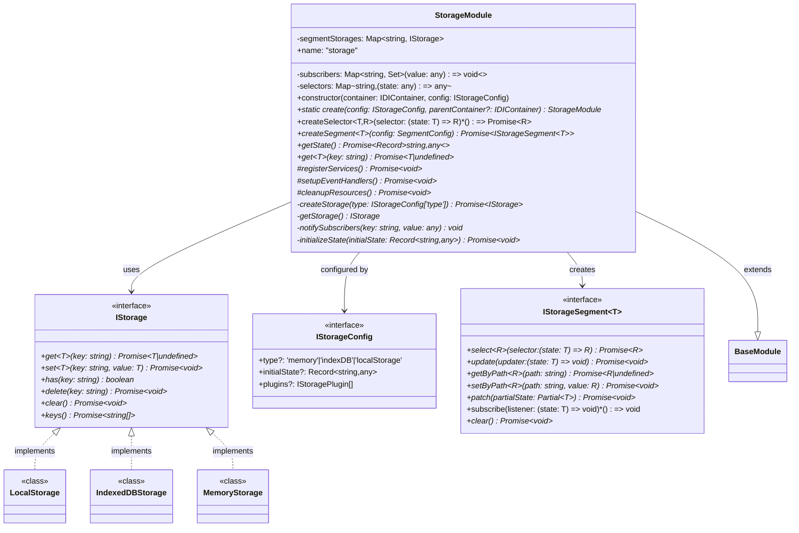

```mermaid
classDiagram
%% Базовые интерфейсы
    class IStorage {
        <<interface>>
        +get~T~(key: string)* Promise~T|undefined~
        +set~T~(key: string, value: T)* Promise~void~
        +has(key: string)* boolean
        +delete(key: string)* Promise~void~
        +clear()* Promise~void~
        +keys()* Promise~string[]~
    }

    class IStorageConfig {
        <<interface>>
        +type?: 'memory'|'indexDB'|'localStorage'
        +initialState?: Record~string,any~
        +plugins?: IStoragePlugin[]
    }

    class IStorageSegment~T~ {
        <<interface>>
        +select~R~(selector: (state: T) => R)* Promise~R~
        +update(updater: (state: T) => void)* Promise~void~
        +getByPath~R~(path: string)* Promise~R|undefined~
        +setByPath~R~(path: string, value: R)* Promise~void~
        +patch(partialState: Partial~T~)* Promise~void~
        +subscribe(listener: (state: T) => void)* () => void
        +clear()* Promise~void~
    }

%% Основной модуль
    class StorageModule {
        -subscribers: Map~string, Set~(value: any) => void~~
        -selectors: Map~string, (state: any) => any~
        -segmentStorages: Map~string, IStorage~
        +name: "storage"
        +constructor(container: IDIContainer, config: IStorageConfig)
        +static create(config: IStorageConfig, parentContainer?: IDIContainer)* StorageModule
        +createSelector~T,R~(selector: (state: T) => R)* () => Promise~R~
        +createSegment~T~(config: SegmentConfig)* Promise~IStorageSegment~T~~
        +getState()* Promise~Record~string,any~~
        +get~T~(key: string)* Promise~T|undefined~
        #registerServices()* Promise~void~
        #setupEventHandlers()* Promise~void~
        #cleanupResources()* Promise~void~
        -createStorage(type: IStorageConfig['type'])* Promise~IStorage~
        -getStorage()* IStorage
        -notifySubscribers(key: string, value: any)* void
        -initializeState(initialState: Record~string,any~)* Promise~void~
    }

%% Реализации хранилища
    class LocalStorage {
        <<class>>
    }

    class IndexedDBStorage {
        <<class>>
    }

    class MemoryStorage {
        <<class>>
    }

%% Связи
    IStorage <|.. LocalStorage : implements
    IStorage <|.. IndexedDBStorage : implements
    IStorage <|.. MemoryStorage : implements
    StorageModule --> IStorage : uses
    StorageModule --> IStorageSegment : creates
    StorageModule --> IStorageConfig : configured by
    StorageModule --|> BaseModule : extends
```
