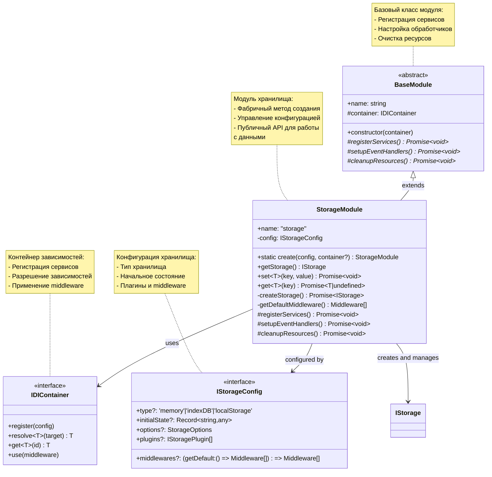
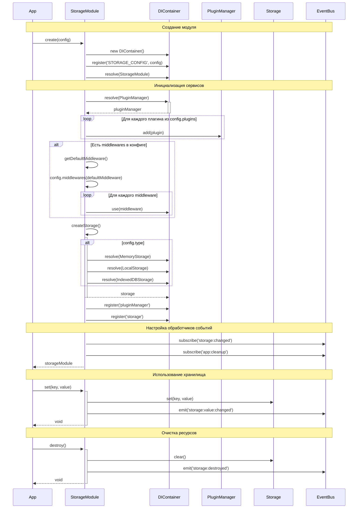

```mermaid
classDiagram
%% Базовые интерфейсы и абстракции
    class BaseModule {
        <<abstract>>
        +name: string
        #container: IDIContainer
        +constructor(container)
        #registerServices()* Promise~void~
        #setupEventHandlers()* Promise~void~
        #cleanupResources()* Promise~void~
    }
    note for BaseModule "Базовый класс модуля:
    - Регистрация сервисов
    - Настройка обработчиков
    - Очистка ресурсов"

    class IStorageConfig {
        <<interface>>
        +type?: 'memory'|'indexDB'|'localStorage'
        +initialState?: Record~string,any~
        +options?: StorageOptions
        +plugins?: IStoragePlugin[]
        +middlewares?: (getDefault: () => Middleware[]) => Middleware[]
    }
    note for IStorageConfig "Конфигурация хранилища:
    - Тип хранилища
    - Начальное состояние
    - Плагины и middleware"

    class IDIContainer {
        <<interface>>
        +register(config)
        +resolve~T~(target) T
        +get~T~(id) T
        +use(middleware)
    }
    note for IDIContainer "Контейнер зависимостей:
    - Регистрация сервисов
    - Разрешение зависимостей
    - Применение middleware"

%% Основной класс модуля
    class StorageModule {
        +name: "storage"
        -config: IStorageConfig
        +static create(config, container?) StorageModule
        +getStorage() IStorage
        +set~T~(key, value) Promise~void~
        +get~T~(key) Promise~T|undefined~
        -createStorage() Promise~IStorage~
        -getDefaultMiddleware() Middleware[]
        #registerServices() Promise~void~
        #setupEventHandlers() Promise~void~
        #cleanupResources() Promise~void~
    }
    note for StorageModule "Модуль хранилища:
    - Фабричный метод создания
    - Управление конфигурацией
    - Публичный API для работы
    с данными"

%% Связи
    BaseModule <|-- StorageModule : extends
    StorageModule --> IDIContainer : uses
    StorageModule --> IStorageConfig : configured by
    StorageModule --> IStorage : creates and manages
```

```mermaid
sequenceDiagram
    participant App
    participant SM as StorageModule
    participant DI as DIContainer
    participant PM as PluginManager
    participant S as Storage
    participant EB as EventBus

    Note over App,EB: Создание модуля
    App->>+SM: create(config)
    SM->>DI: new DIContainer()
    SM->>DI: register('STORAGE_CONFIG', config)
    SM->>DI: resolve(StorageModule)

    Note over App,EB: Инициализация сервисов
    SM->>+DI: resolve(PluginManager)
    DI-->>-SM: pluginManager

    loop Для каждого плагина из config.plugins
        SM->>PM: add(plugin)
    end

    alt Есть middlewares в конфиге
        SM->>SM: getDefaultMiddleware()
        SM->>SM: config.middlewares(defaultMiddleware)
        loop Для каждого middleware
            SM->>DI: use(middleware)
        end
    end

    SM->>+SM: createStorage()
    alt config.type
        SM->>DI: resolve(MemoryStorage)
        SM->>DI: resolve(LocalStorage)
        SM->>DI: resolve(IndexedDBStorage)
    end
    SM-->>-DI: storage

    SM->>DI: register('pluginManager')
    SM->>DI: register('storage')

    Note over App,EB: Настройка обработчиков событий
    SM->>EB: subscribe('storage:changed')
    SM->>EB: subscribe('app:cleanup')

    SM-->>App: storageModule

    Note over App,EB: Использование хранилища
    App->>+SM: set(key, value)
    SM->>S: set(key, value)
    SM->>EB: emit('storage:value:changed')
    SM-->>-App: void

    Note over App,EB: Очистка ресурсов
    App->>+SM: destroy()
    SM->>S: clear()
    SM->>EB: emit('storage:destroyed')
    SM-->>-App: void
```
