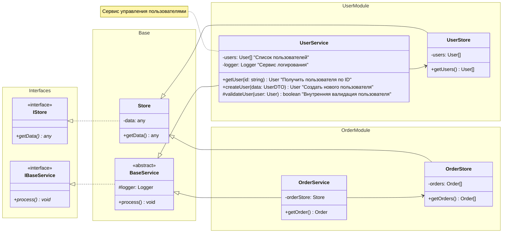
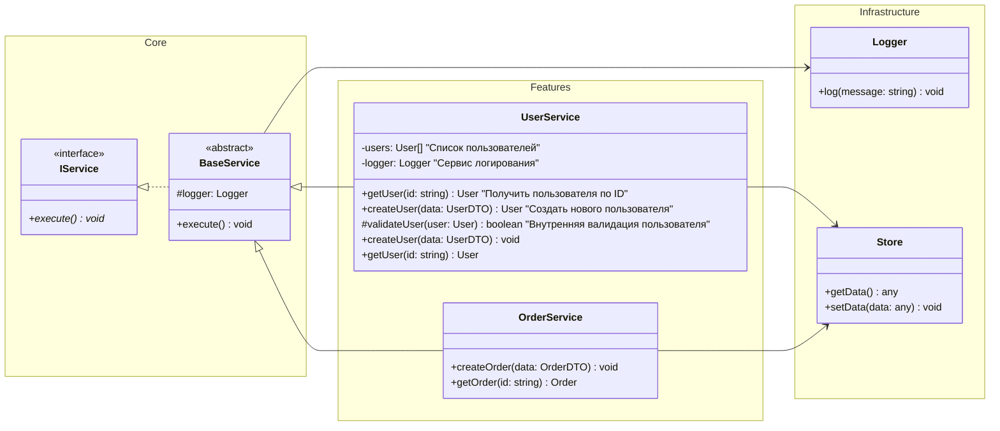

Да, у нас возникла проблема с пустыми классами. Давайте исправим пример и покажем другие способы управления расположением:

**Типы связей** влияют на расположение:
- `-->` стандартная связь
- `-.->` пунктирная линия
- `==>` жирная линия
- `--o` агрегация
- `--*` композиция
- `--|>` наследование
- `..|>` реализация интерфейса

В диаграммах классов эти символы обозначают модификаторы доступа (visibility modifiers):
+ означает public метод/свойство
- означает private метод/свойство
# означает protected метод/свойство
~ означает package/internal (доступ на уровне пакета/модуля)

Давайте теперь попробуем другой подход с использованием подграфов и другим направлением:

Вот основные приёмы для управления расположением в Mermaid:

1. **Использование direction**:
    - `direction TB` - вертикальное расположение (сверху вниз)
    - `direction LR` - горизонтальное расположение (слева направо)
    - Выбирайте направление в зависимости от типа иерархии и количества связей

2. **Группировка через namespace**:
    - Помогает логически группировать связанные классы
    - Создаёт визуальные границы между группами
    - Влияет на расположение связей

3. **Порядок объявления**:
    - Классы и связи располагаются в порядке их объявления
    - Объявляйте классы в том порядке, в котором хотите их видеть
    - Группируйте связанные объявления вместе

4. **Управление связями**:
    - Используйте разные типы связей для лучшей читаемости
    - Порядок объявления связей влияет на их маршрутизацию
    - Старайтесь объявлять связи после всех классов

5. **Комментарии как разделители**:
    - Используйте `%%` для визуального разделения секций
    - Помогает организовать код диаграммы
    - Улучшает читаемость и поддерживаемость

