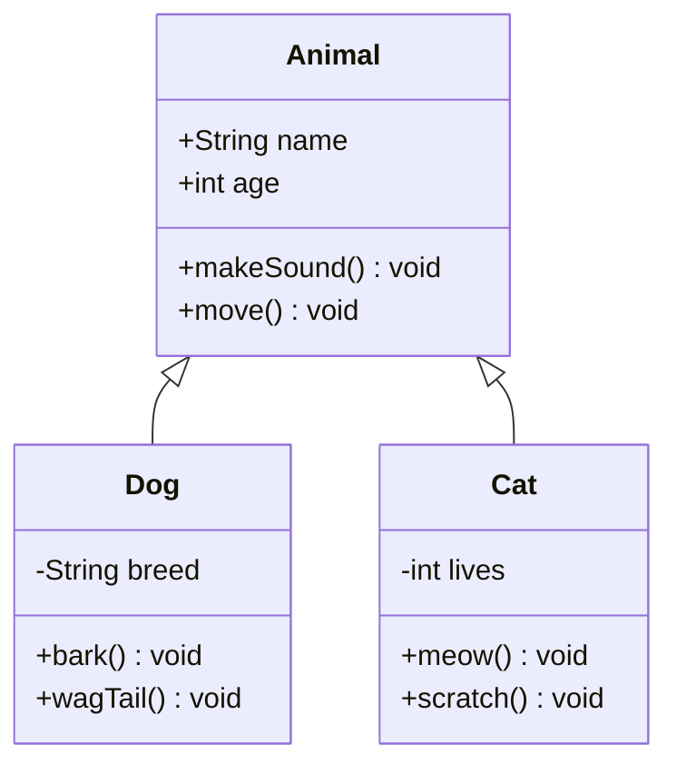
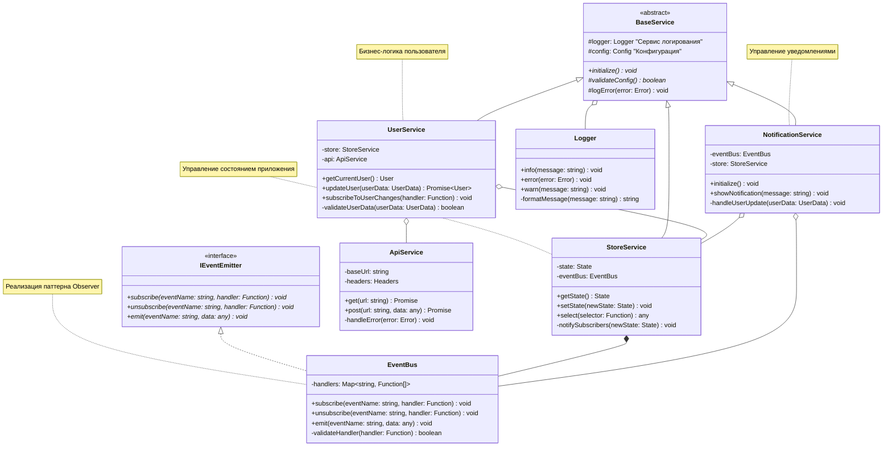
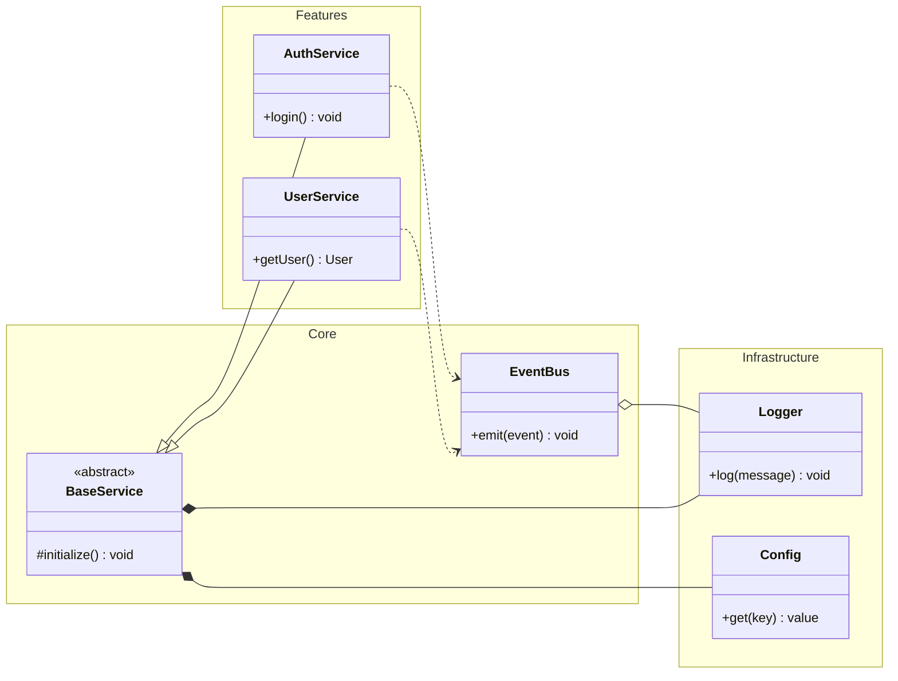
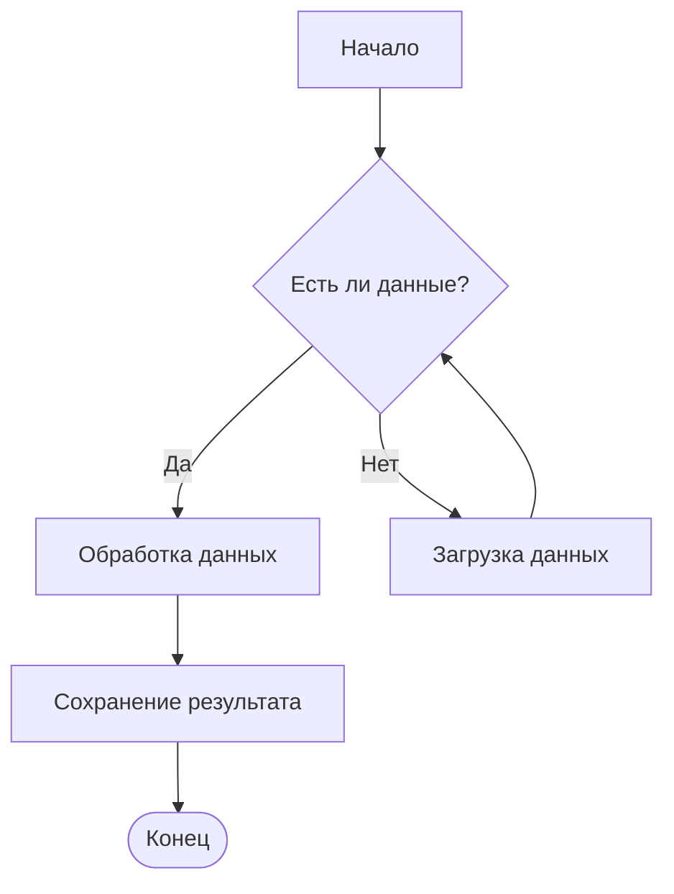
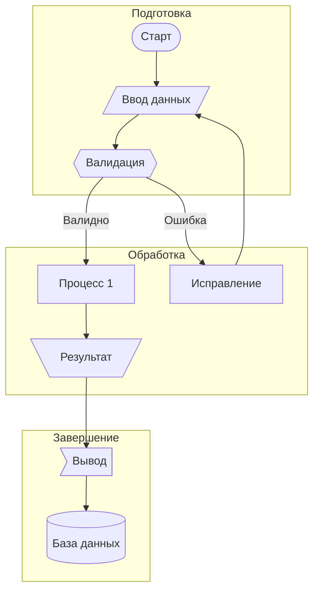
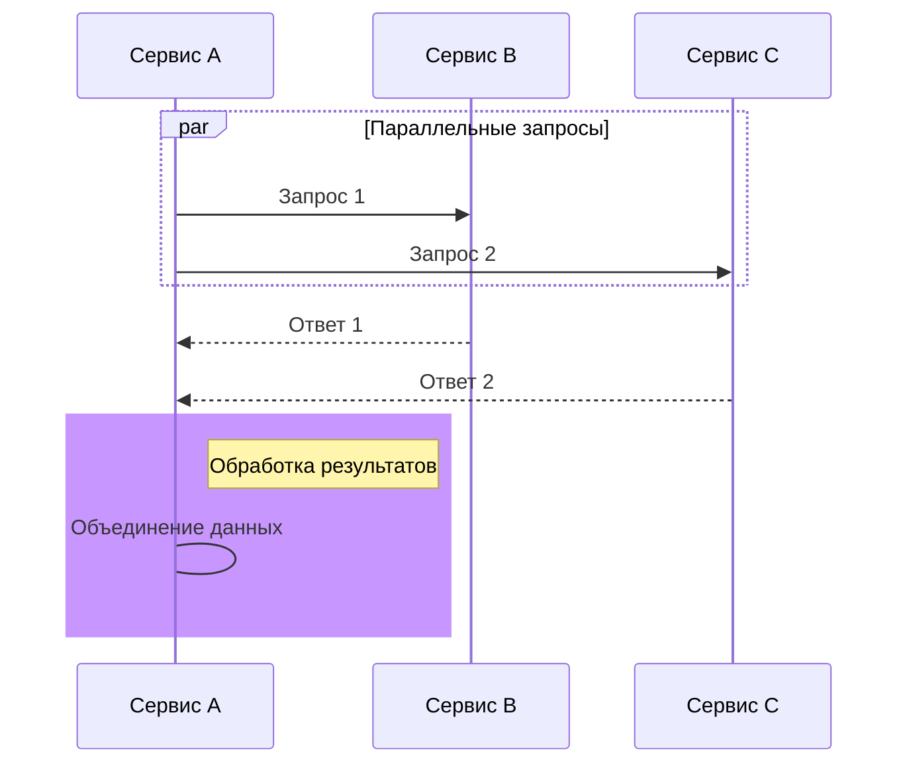
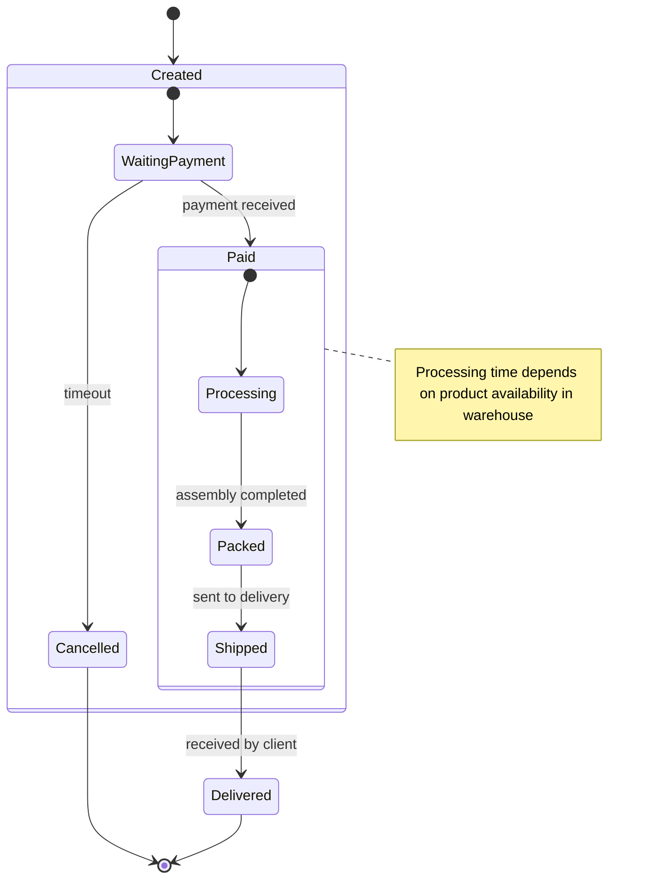
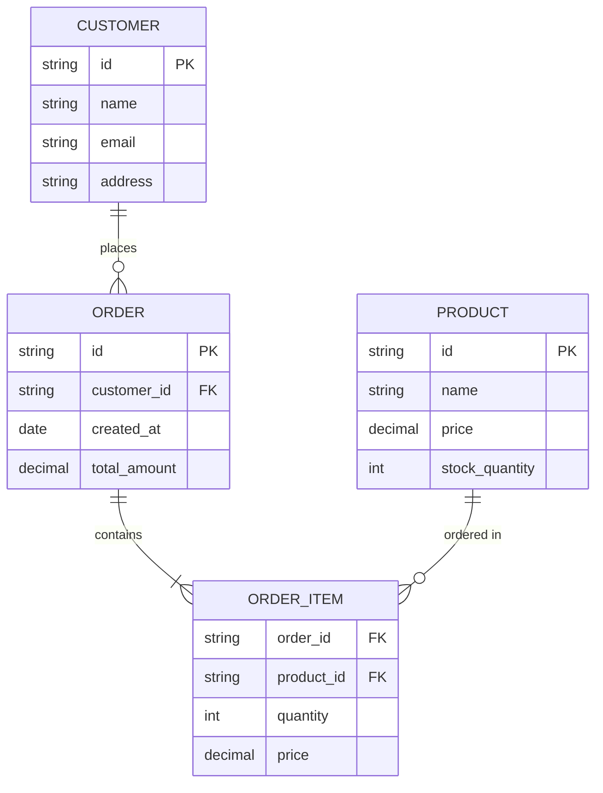
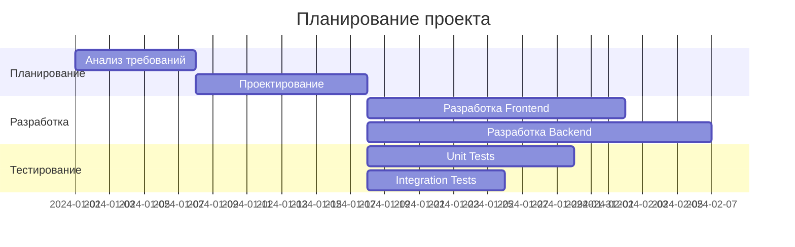
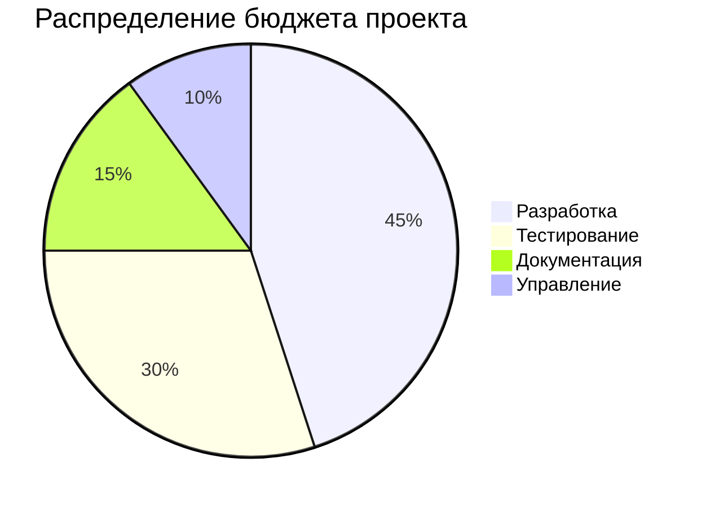

# Расширенное руководство по Mermaid

## 1. Диаграмма классов (Class Diagram)

### Базовый пример


### Продвинутый пример с разными типами связей






Основные способы управления расположением в Mermaid:

1. **Направление диаграммы**:
- TB: top to bottom (сверху вниз)
- BT: bottom to top (снизу вверх)
- LR: left to right (слева направо)
- RL: right to left (справа налево)


2. **Типы связей** влияют на расположение:
- `-->` стандартная связь
- `-.->` пунктирная линия
- `==>` жирная линия
- `--o` агрегация
- `--*` композиция
- `--|>` наследование
- `..|>` реализация интерфейса

3. **Управление отступами и пробелами**:
- Используйте пустые строки между секциями
- Выравнивайте связанные классы
- Группируйте связанные элементы вместе

4. **Оптимизация связей**:
- Старайтесь минимизировать пересечения линий
- Размещайте связанные классы ближе друг к другу
- Используйте иерархическую структуру

Давайте создам ещё один пример, который комбинирует разные подходы к управлению расположением:

Некоторые советы по оптимизации расположения:

1. **Иерархическое расположение**:
   - Размещайте базовые классы/интерфейсы сверху или слева
   - Расположите наследников ниже или справа

2. **Группировка по функциональности**:
   - Используйте namespaces или subgraphs для логически связанных классов
   - Сохраняйте связанные сервисы рядом

3. **Минимизация пересечений**:
   - Старайтесь располагать классы так, чтобы минимизировать пересечение линий
   - Используйте разные типы связей для лучшей читаемости

4. **Баланс и симметрия**:
   - Старайтесь равномерно распределять классы
   - Соблюдайте визуальный баланс в диаграмме


## 2. Блок-схема (Flowchart)

### Простой пример процесса


### Сложный пример с разными формами и подграфами


## 3. Диаграмма последовательности (Sequence Diagram)

### Пример взаимодействия с сервером
```mermaid
sequenceDiagram
   actor User
   participant Client
   participant Server
   participant DB

   User->>+Client: Отправить форму
   activate Client
   Client->>+Server: POST /api/data
   Server->>+DB: Сохранить данные

   alt Успешно
      DB-->>-Server: Данные сохранены
      Server-->>-Client: 200 OK
      Client-->>-User: Показать успех
   else Ошибка
      DB-->>-Server: Ошибка
      Server-->>-Client: 500 Error
      Client-->>-User: Показать ошибку
   end

   note right of Server: Обработка может занять время
```

### Пример с параллельным выполнением


## 4. Диаграмма состояний (State Diagram)

### Пример жизненного цикла заказа


## 5. ER-диаграмма (Entity Relationship Diagram)

### Пример базы данных интернет-магазина


## 6. Gantt-диаграмма (добавлено)

### Пример планирования проекта


## 7. Круговая диаграмма (добавлено)

### Пример распределения бюджета


## Дополнительные советы

1. **Стилизация**
   - Можно использовать различные цвета для узлов и связей
   - Поддерживаются HTML-цвета и RGB/RGBA
   - Можно настраивать толщину линий и стиль границ

2. **Интерактивность**
   - Многие диаграммы поддерживают кликабельные элементы
   - Можно добавлять ссылки на элементы
   - Поддерживаются всплывающие подсказки

3. **Масштабирование**
   - Диаграммы автоматически масштабируются
   - Можно указывать направление и размер диаграммы

4. **Импорт/Экспорт**
   - Диаграммы можно экспортировать в SVG или PNG
   - Код диаграммы можно сохранять в markdown-файлах
   - Поддерживается встраивание в различные платформы
